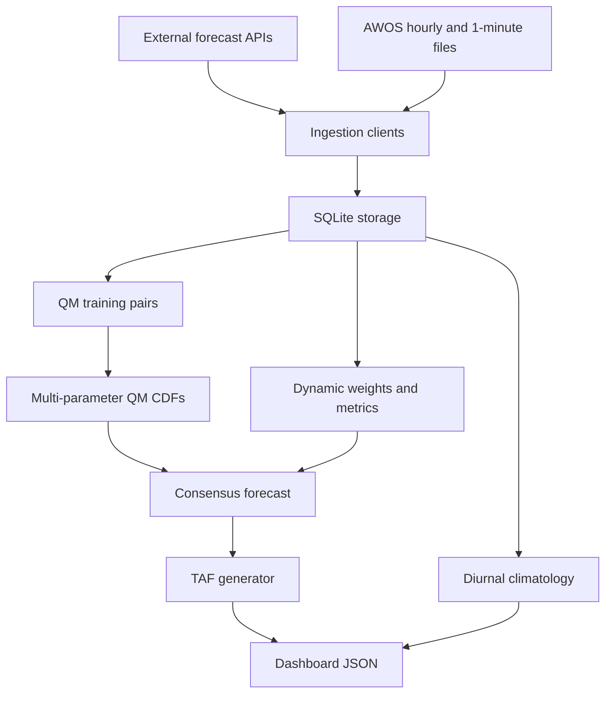

# Architecture

## Logical Layers

1. Ingestion: Open-Meteo forecast API and AWOS files.
2. Persistence: SQLite tables for forecasts, observations, QM CDFs, and training pairs.
3. Processing: consensus generation, model weighting, quantile mapping, and diurnal analysis.
4. Forecasting: TAF base group and change-group generation.
5. Assessment: forecast-observation pairing and skill metrics.
6. Presentation: JSON and static dashboard assets under `docs/`.
7. Automation: GitHub Actions scheduled pipeline runs.

